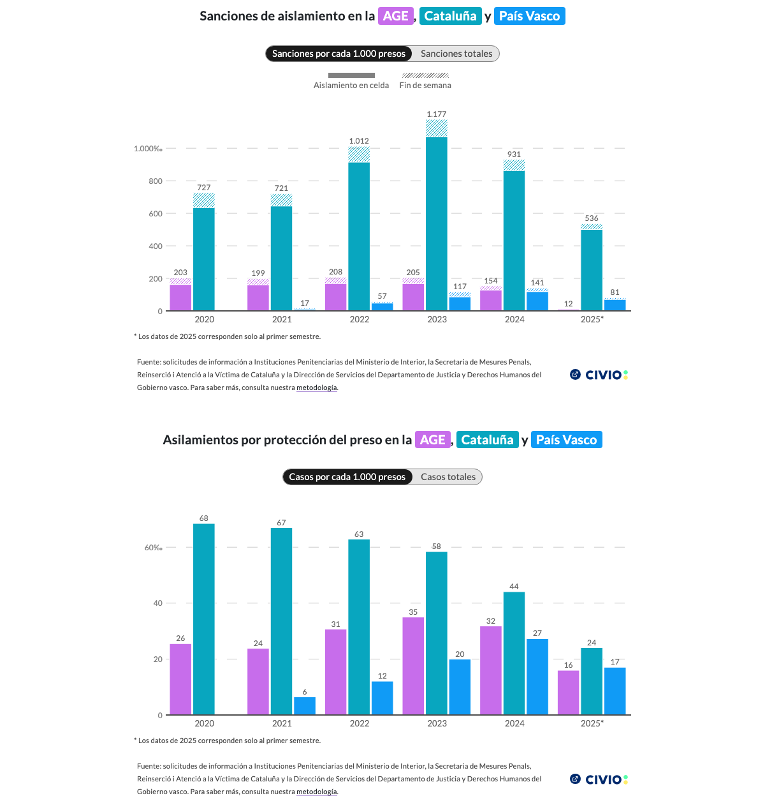

# Sanctions by Prison Administration

Stacked bar chart comparing solitary confinement sanctions and protective isolation across Spain's three prison administrations (AGE, Catalonia, Basque Country) over time.



## Live preview

**Dataviz URL**: https://graphs.civio.es/justicia/aislamiento-prisiones/sanciones-administracion/dist

**Investigation URL**: https://civio.es/justicia/2026/03/04/aislamiento-el-castigo-en-prision-que-viola-todas-las-recomendaciones-de-la-onu/

## Languages

- Spanish

## Stack

- **Framework**: Svelte 5
- **Bundler**: Vite 7
- **Other**: D3 (scales, grouping), Playwright (iframe generation)

## Accessibility

- Screen reader descriptions generated from data (`src/a11y/`) in table format per chart type
- `ScreenReaderDescription` component renders sr-only content with list/table formats
- Debug mode via `?a11y` URL param; alt text mode via `?alt`
- Focus-visible styles for keyboard navigation

## Development

Requires Node v24.13.0.

```bash
nvm install 24.13.0 # if you don't have it
nvm use
npm install
npm run dev
```

## Build

```bash
npm run build
```
