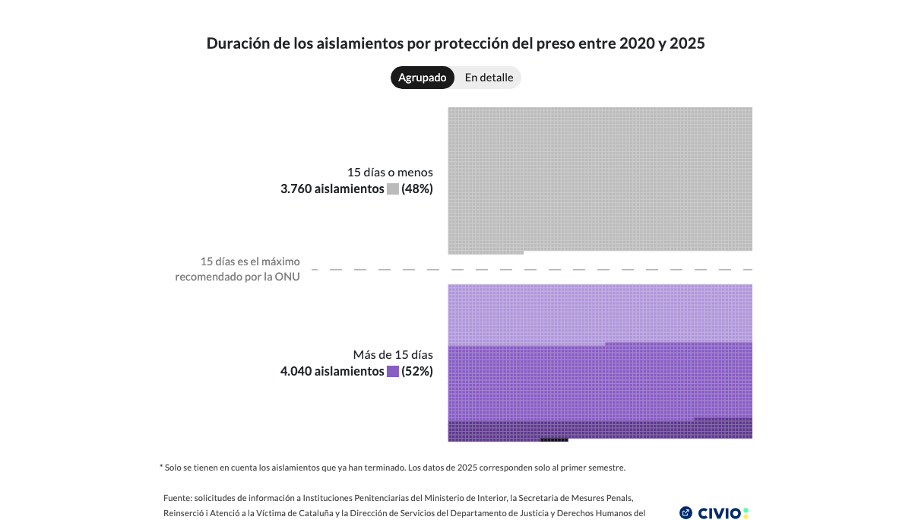

# Time in Limbo

Canvas-based waffle chart visualizing how long inmates spend in isolation in Spanish prisons. Shows 7,800 cases distributed across 5 duration groups, with the UN-recommended 15-day maximum highlighted. Supports grouped and expanded detail views.



## Live preview

**Dataviz URL**: https://graphs.civio.es/justicia/aislamiento-prisiones/tiempos-limbo/dist

**Investigation URL**: https://civio.es/justicia/2026/03/04/aislamiento-el-castigo-en-prision-que-viola-todas-las-recomendaciones-de-la-onu/

## Languages

- Spanish

## Stack

- **Framework**: Svelte 5
- **Bundler**: Vite 7
- **Other**: D3 (scales, number formatting), Playwright (iframe generation)

## Accessibility

Screen reader descriptions with list/table format auto-selected based on data complexity. Debug mode (`?a11y`) and alt-text mode (`?alt`) available.

## Development

Requires Node v24.13.0.

```bash
nvm install 24.13.0 # if you don't have it
nvm use
npm install
npm run dev
```

## Build

```bash
npm run build
```
