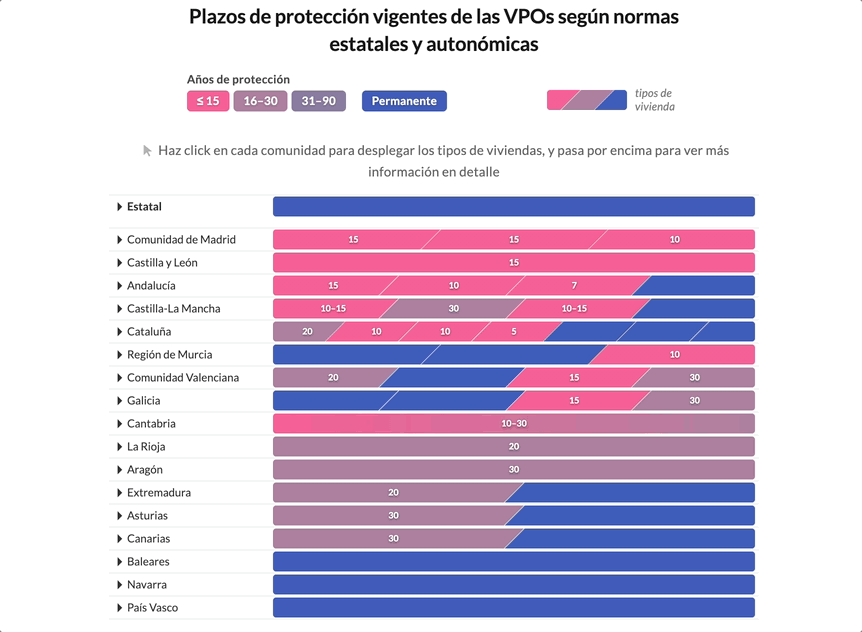

# Plazos VPO 2026

Comparison of the protection periods for publicly subsidised housing (VPO) across Spain's autonomous communities under the regulations in force in 2026. Each region appears as a colour-coded band — from short (≤15 years) to permanent protection — that expands on click to reveal the periods set per housing type. The chart makes visible how long, and how unevenly, a protected home stays protected before passing to the free market.



## Live preview

**Dataviz URL**: https://graphs.civio.es/lopublico/perdida-vpo/plazos-vpo-2026/dist

**Investigation URL**: https://civio.es/lo-publico/2026/05/21/en-2031-habra-pasado-al-mercado-libre-al-menos-la-mitad-del-millon-y-medio-de-viviendas-protegidas-construidas-desde-1991/

## Stack

- **Framework**: Svelte 5 (runes)
- **Bundler**: Vite
- **Languages**: Spanish
- **Other**: D3 (number formatting), Playwright (responsive iframe measurement)

## Accessibility

The visual chart is entirely hidden from screen readers (`aria-hidden` on the grid). Alongside it, a separate `sr-only` semantic version is rendered from the same data:

- A short description of the **shape** of the chart — its grid layout, the colour code, and which CCAAs head and close the list — plus a brief navigation hint.
- One `<h4>` per row (Estatal + each CCAA), each followed by a `<ul>` listing every housing type and its protection period.

This way the screen-reader user first gets a mental map of the chart, then walks the detail row by row.

Debug mode: `?a11y` / `data-a11y` reveals the `sr-only` content, paints `aria-label`s on landmarks and lowers opacity for `aria-hidden` elements.

## Development

Requires Node v24.13.0.

```bash
nvm install v24.13.0 # if you don't have it
nvm use
npm install
npm run dev
```

## Build

```bash
npm run build
```
