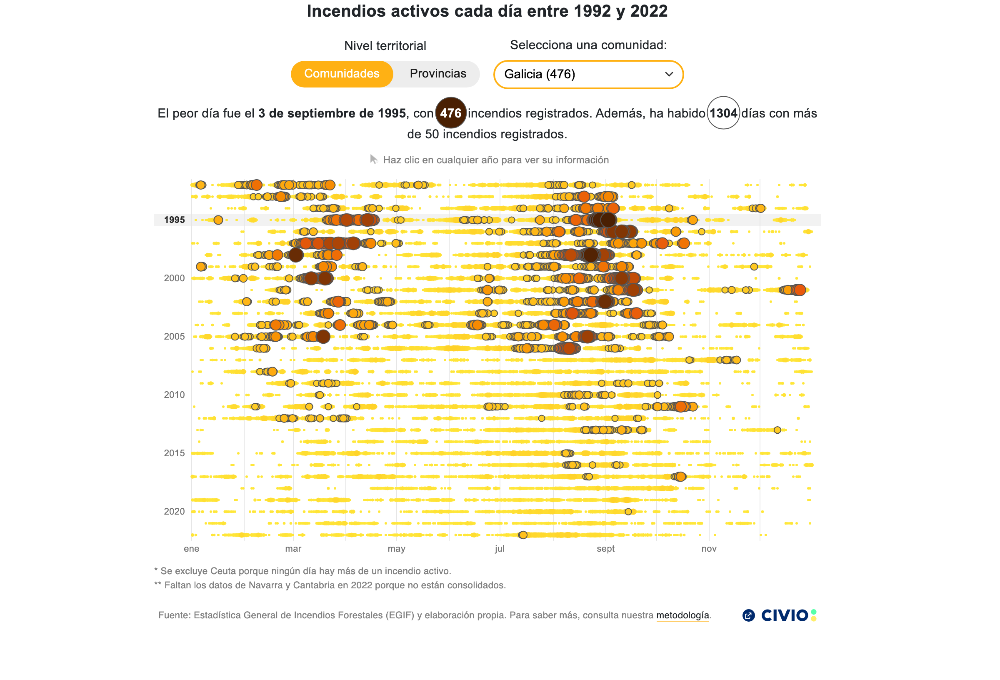

# Días negros heatmap

Canvas-based heatmap of daily active wildfires in Spain between 1992 and 2022, by comunidad or provincia: one row per year, one circle per day, sized and colored by the number of active fires, with the days above the severe threshold (50 fires) outlined. Clicking a year opens a month-grid detail of that year. 



## Live preview

**Dataviz URL**: https://graphs.civio.es/medioambiente/dias-negros/heatmap/dist

**Investigation URL**: https://civio.es/medio-ambiente/2026/08/04/las-jornadas-donde-una-sola-provincia-sufrio-mas-de-100-incendios-forestales-a-la-vez/

## Stack

- **Framework**: Svelte 5 (runes)
- **Bundler**: Vite
- **Languages**: Spanish
- **Other**: D3 (scales, CSV loading, grouping), Playwright (iframe generation)

## Accessibility

- Screen reader descriptions of the whole chart generated from the data (`src/a11y/`), rendered by `ScreenReaderDescription`.
- `DayByDayList` provides a keyboard/screen-reader day-by-day alternative to the canvas tooltip.
- Focus is trapped inside the tooltip and share dialogs (`utils/focusTrap.js`).
- Debug mode via the `?a11y` URL param (visualizes sr-only content); alt-text mode via `?alt`.

## Development

Requires Node v24.13.0.

```bash
nvm install v24.13.0 # if you don't have it
nvm use
npm install
npm run dev
```

## Build

```bash
npm run build
```
