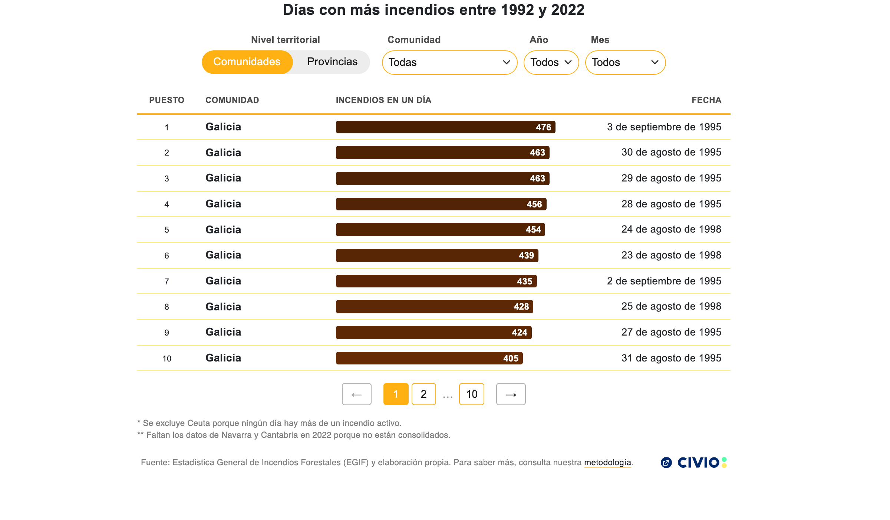

# Tabla incendios (días negros)

Ranked table of Spain's "días negros": the days with the most simultaneous active wildfires per comunidad or provincia, built from EGIF data (1992-2022). It includes a territorial level switch (comunidades/provincias), cascading community/province filters, year and month filters, pagination and color-scaled bars sized by the number of active fires.



## Live preview

**Dataviz URL**: https://graphs.civio.es/medioambiente/dias-negros/tabla-incendios/dist

**Investigation URL**: https://civio.es/medio-ambiente/2026/08/04/las-jornadas-donde-una-sola-provincia-sufrio-mas-de-100-incendios-forestales-a-la-vez/

## Stack

- **Framework**: Svelte 5 (runes)
- **Bundler**: Vite
- **Languages**: Spanish
- **Other**: D3 (data loading, ranking and color scale), Playwright (iframe breakpoints)

## Accessibility

The visualization is a native HTML table, accessible by itself, so the screen reader description (`ScreenReaderDescription.svelte`) carries only the summary insight without duplicating data rows. Filters are labelled form controls and the territorial level switch is a `radiogroup`. Debug mode via `?a11y` or `data-a11y`; text alternative mode via `?alt` or `data-alt`.

## Development

Requires Node 24.13.0.

```bash
nvm install 24.13.0 # if you don't have it
nvm use
npm install
npm run dev
```

## Build

```bash
npm run build
```
